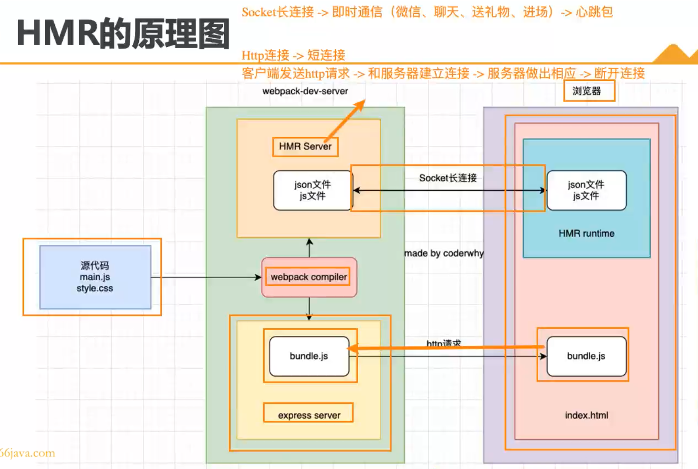
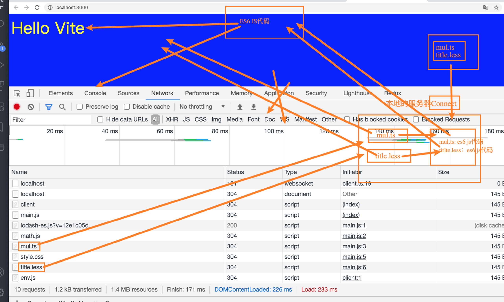
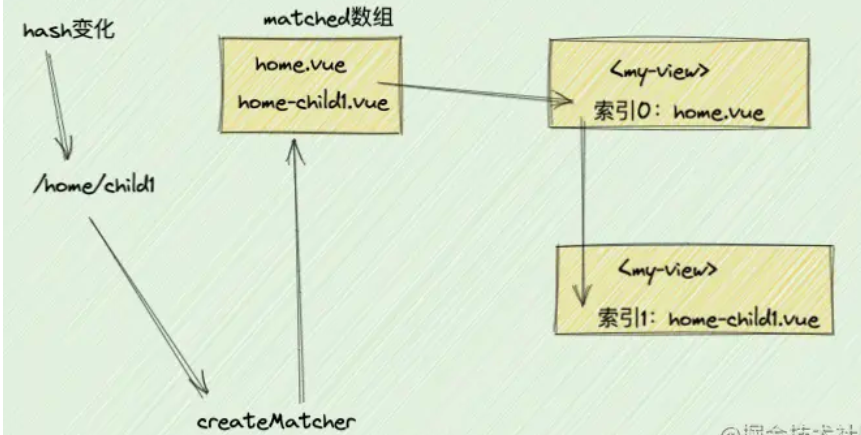

# 面试问题准备：

## CSS
1. 文本居中：
    * 文本水平居中：父元素设置`text-algin: center`
    * 文本垂直居中：`line-height`等于容器`height`；


2. flex布局又叫弹性布局。由容器和项目组成。开启弹性布局的方式是display:flex。此元素就会变成一个弹性容器，此元素的子元素都会变成弹性项目。

``` css
.container {
  background-color: rgba(54, 54, 230, 0.747);
  margin: 5px;

  width: 100vw;
  height: 100vh;
    
  display: flex;
  flex-direction: column;
  justify-content: center;
  align-items: center;
    
  transition: all   .5s;
  }
  .parent{
  width: 100%;
  height: 33%; 
      
  display: flex;
  flex-direction: row;
  justify-content: space-around;
  align-items: center;

  background-color: rgba(230, 212, 54, 0.952);
  transition: all   .5s;
  }
  .parent \> div{
  width: 14%;
  height: 100%;
  background-color: rgba(54, 230, 122, 0.747);
   }
```


## JavaScript

* **作用域** – 词法环境 (lexical environment)
    - 不在一个父prototype的函数不能有相同的作用域，子prototype如果没有，会去父prototype查找。
    - 如果一个函数在另一个作用域被调用时，`this = undefined`，那么就需要把上下文传入才能使用，`.bind(this)`， 箭头函数也可以。

* **原型链** 看作用域this
    
* **闭包**  
        -  它是这样工作的，无论何时声明新函数并将其赋值给变量，都要存储函数定义和闭包。闭包包含在函数创建时作用域中的所有变量，它类似于背包。函数定义附带一个小背包，它的包中存储了函数定义创建时作用域中的所有变量。
        - **本质就是上级作用域内变量的生命周期，因为被下级作用域内引用，而没有被释放。就导致上级作用域内的变量，等到下级作用域执行完以后才正常得到释放。**
    
* **this**
    
* **Event Loop** ——JavaScript执行机制
    - 浏览器中执行的过程是，js代码同步代码执行，遇到微任务放入微任务队列中，遇到宏任务是开启相应的宏任务线程（例如定时器，会开启定时器线程，定时器线程到指定时间，会把回调任务放入宏任务队列）。
* `object.freeze(obj)`才是真正的常量； `const`是固定地址
* **Mixin**: 
    是一个通用的面向对象编程术语：一个包含其他类的方法的类。
    用得到的时候，用：
    `Object.assign(Menu.prototype, eventMixin);`  
          复制到需要Mixin封装的方法的class原型里。

* Generator:
    - 常规函数只会返回一个单一值（或者不返回任何值）。而 _Generator 可以按需一个接一个地返回（“yield”）多个值。它们可与 [iterable](https://zh.javascript.info/iterable) 完美配合使用，从而可以轻松地创建数据流。_

* JavaScript **异步方式**共有有下面六种:  

       - 事件监听
       - 回调函数
       - 发布/订阅
       - Promise
       - 生成器
       - async/await
       
    - `setTimeout( func , 0 ) `让func尽快执行，但是是在当前脚本执行完后，和script.onload一个作用，用于执行函数回调。
    - `addEventListener(event, handler)  `  
    - `removeEventListener(event, handler)` 同样需要传入handler
* **Promise**: 
    - 回调好用，但是有**回调地狱**
 ``` js
    let promise = new Promise((resolve, reject) => {
    //executor
    });
```
   - 有 `.then() / .catch(e) / .finally()` 这几个方法  
 ``` js
    promise.then(
      result => alert(result), // 1 秒后显示 "done!"
      error => alert(error) // 不运行 对error不感兴趣可以不传入reject
    )
    .catch(errorHandlingFunction); // = .then(null, errorHandler); 
    .finally(f); // = .then(f, f);  只要是settled状态就触发f
```
   - Promise链： `result`会在handler 比如 `then()` 中传递，直到`error `移交到最近的`catch`。
   - **还有juejinNOTE没看**
    
* **async/await**：promise语法糖，async让func( )返回promise 即可`func( ).then( )`
    - **async** 有两个作用：
	- 让这个函数总是返回一个 promise
    - 允许在该函数内使用 await
    - **await** 使 JavaScript 引擎等待该 promise settled
    - 如果有 error，就会抛出异常 — 就像那里调用了 throw error 一样

* **跨域同源**：
    - 首先讲一下同源限制，同源限制是指协议，IP，端口一致才算同源。同源限制了以下是哪个方面：
        1.  当前域下的js脚本不能访问其他域下的cookie,localstorage,sessionstorage,indexdb
        2.  当前域下的js脚本不能访问其他域下的dom
        3.  当前域下的ajax不能发生跨域请求。

    - 解决跨域的方式有jsonp,cors，nginx，websocket，node中间件。  
            jsonp方式实现如下：
            先创建一个script标签，在其src中加入带callback的url。然后把script标签加入document中。即会发送请求，后端返回一个字符串，script标签会解析，然后执行字符串对应的js脚本。这段Js脚本会去执行页面中写的回调函数。

## Webpack
1. entry文件树入口 output 输出 默认打包js
2. 不同的文件需要在下面的模块中配置好相应的loader，且loader要npm安装
``` json
modules: {
    rules:[ 
    {
        test:… , 
        use: … - loader
    }  
]}
```
3. Plugins 插件：几个重要插件
      - clean-webpack-plugin 删除build再更新
      - html-webpack-plugin 打包自动生成index.html，有模板html在
      - definePlugin 配置全局常量， 给html模板编写提供支持
      - copy-webpack-plugin 文件夹复制，可设置忽略文件rules

4. 其他配置： 
    - `mode: "development"`
    - `devtool: "source-map"` 默认eval，会生成代码查找路径，不然就是糊成一团的js代码
    - babel: 本质是一个compiler。  
        作用：旧代码向后兼容、语法转换等。 需要转换什么代码就装什么插件。
        使用： `webpackConfig: babel-loader option:preset ...`
        也可以单独写一个`babel.config.json`
5. vue模块  vuecli已经集成好了  
    vue通过webpack打包成:
    - vue[.runtime].global[.prod]
    - vue[.runtime].esm-browser[.prod]
    - vue[.runtime].esm-bundler.js  这个最常用 
6. devServer 
    npm run serve的配置，webpack监听我的代码——搭建本地服务，替换热模块
    HMR原理： 
  
## Vue-CLI脚手架
1. cli内置了webpack的相关配置，不需要从零开始
2. `npm install @vue/cli -g`
    `vue create 项目名称`

## Vite
1. 基于es-module的开发服务器， 构成： HMR + rollup构建
2. 思想： 将代码转换为esmodule，让浏览器直接识别，简化开发，不需要build，速度就非常快，等需要上线了再打包。
3. vite原理：
    
4. css、typescript默认支持，但是less postcss需要提前安装
5.  ESBuild的速度原因：
    - Js -> AST -> 字节码 ->机器码
    - esbuild是Go写的， go -> AST ->机器码
    - esbuild充分利用CPU多内核，饱和运行
    - 无任何依赖，自己从零运行
    
    
## Vue Router
原理其实和vuex一样，全局mixin混入，做一个vue插件，这样每个子组件都会继承这个方法。

平时咱们vue-router其实都用很多了，基本每个项目都会用它，因为Vue是单页面应用，可以通过路由来实现切换组件，达到切换页面的效果。咱们平时都是这么用的，其实分为3步

* 1、引入`vue-router`，并使用`Vue.use(VueRouter)`
* 2、定义路由数组，并将数组传入`VueRouter实例`，并将实例暴露出去
* 3、将`VueRouter`实例引入到main.js，并注册到根Vue实例上

- **路由模式**  
        
        路由有三种模式
* 1、`hash模式`，最常用的模式

* 2、`history模式`，需要后端配合的模式  
            由于hash模式会在url中自带#，如果不想要很丑的 hash，我们可
            以用路由的 history 模式，只需要在配置路由规则时，加入"mode: 'history'",**这种模式充分利用了html5 history interface 中新增的 pushState() 和 replaceState() 方法。这两个方法应用于浏览器记录栈，在当前已有的 back、forward、go 基础之上，它们提供了对历史记录修改的功能。只是当它们执行修改时，虽然改变了当前的 URL ，但浏览器不会立即向后端发送请求**。
            
 ``` js
            export const routes = \[ 
            {path: "/", name: "homeLink", component:Home} 
            {path: "/register", name: "registerLink", component: Register}, 
            {path: "/login", name: "loginLink", component: Login}, 
            {path: "*", redirect: "/"}\] // ***
```
    -  **此处就设置如果URL输入错误或者是URL 匹配不到任何静态资源，就自动跳到到Home页面**

            
* 3、`abstract模式`，非浏览器环境的模式


## Vuex
- Vuex的原理通俗讲就是：利用了全局混入Mixin，将你所创建的store对象，混入到每一个Vue实例中
1. 简单  创建state和Mutation
``` js
import { createApp } from 'vue'
import { createStore } from 'vuex'

// 创建一个新的 store 实例
const store = createStore({
  state () {
    return {
      count: 0
    }
  },
  mutations: {
    increment (state) {
      state.count++
    }
  }
})

const app = createApp({ /* 根组件 */ })

// 将 store 实例作为插件安装
app.use(store)
```
2. 获取 state 
    通过computed() { }来获取或计算state值
* this.$store.state.count
* mapState({...})

3. getters
* Getters - state 类似computed - data的关系
``` js
state: {
    todos: [
      { id: 1, text: '...', done: true },
      { id: 2, text: '...', done: false }
    ]
  },
  getters: {
    doneTodos: state => {
      return state.todos.filter(todo => todo.done)
    }
  }
```
需要获取多个getters时，用`mapGetters( obj or [String] ) `辅助函数

4. Mutation
类似于事件， 组件可申请mutation内的方法造成state的变化
* `this.$store.commit()`
*
``` js
method: {
    mapMutation([
        'mutationMethod1', ...
    ])
}
```

5. Action
    - Action 类似于 mutation，不同在于：	
    - Action 提交的是 mutation，而不是直接变更状态。Action 可以包含任意异步操作。
    - `this.$store.dispatch(name, payload)`
6. Module
一个store分割成多个，最后
``` js
const store = new Vuex.Store({
  modules: {
    a: moduleA,
    b: moduleB
  }
})
store.state.a // -> moduleA 的状态
store.state.b // -> moduleB 的状态
```
    - 每个模块中的`state`都是局部状态
## (待定)Typescript
1.
2.
3.


## (待定)项目

* Login in设计：
1. 设置路由守卫，没有获得token就强制跳转到login页面
2. 通过axios请求拦截添加token
3. 之后的每次axios请求都会携带token


## (待定)Vue基础语法
1. bind
2. on
3. 。。。
4. 
## Vue组件化操作
* **虚拟DOM 和 Diff算法**
    - 虚拟dom是DOM对象的一个js抽象对象。由于真实DOM操作耗时，而虚拟dom操作效率比较高，在一系列虚拟dom操作后再合并到真实DOM节点中，可以节省很多时间。

    - vue中虚拟dom更新算法的核心是同层比较vnode，根据差异patch节点。

    - diff算法的过程是：

    首先比较新旧vnode的父节点，如果父节点不一致，那么直接用新vnode替换旧vnode。如果父节点一致，开启updateChildren()阶段。

    如果新旧节点只有一方存在子结点，那么按照新vnode更新。

    如果双方都有子结点存在，首先根据用户设置的key来给子结点排序。若子结点key相同，那么比较子结点的内容，如果内容一致则复用。如果内容不一致，则按照新vnode更新重新渲染节点。

        如果子结点是一个组件，那么只要比较key相同就可以复用，不用比较内容。
        
        
*  **props**操作看商品页面：(后面有router vuex更好用)

*  **动态组件** ：`keep-alive缓存失活组件 + <component :is="***"></component>`指定激活组件
*  **商品页面 = props操作控制动态组件**  

 -  父主app，子NavBar
 - _父props传商品列表给子，子事件v-for展示所有选项，点击触发返回商品index给父，父展示对应index页面_
    - _v-model 绑定props没看懂_


*  **渲染作用域**： 各论各的，data中的数据只能本级模板能访问  
    - v-slot: 缩写 #
*  **插槽 v-slot**: 
    - name | v-slot: default = "name" | v-slot:[dynamicSlotName]
*  **作用域插槽**:

    - 父用v-slot:default="slotProps" 接受 子级slot元素中绑定的参数，如<slot :item="item" :index="index">，这两个参数还是v-for从data/props中的数组数据items中遍历而来. \
    -  且slotProps可解构，slotProps.item


*  **provide/inject** :

    - **provide 访问data内的数据**，要将
     
    `provide: { }` 
    
    换为 
    
    `provide( ) { return { data......} } `; 
    
    - 且data给provide赋值是一次性，并不是响应式，除非该数据是ref对象 -- provideData: Vue.computed( ( ) => this.length )
    
    - computed property，可以在响应式中


* **异步组件**：` defineAsyncComponent( ()=>new promise )`  

    or  – ` <Suspense>` + 异步组件
    
* **模板引用** : this.$refs.xxx来访问当前作用域中的元素，抓取DOM元素内容。组件以proxy函数被代理传入，可以访问data内的属性，methods内的函数


### **CompositionAPI** ([看组合式API 的 onenote](https://onedrive.live.com/redir?resid=751E8644E300C0B2%213856&page=View&wd=target%28Vue3%E8%AF%AD%E6%B3%95.one%7Cc0fa9cef-1749-49c3-b8d1-bdc14ab605e1%2F%E5%8F%AF%E5%A4%8D%E7%94%A8%E7%BB%84%E5%90%88%20CompositionAPI%7C19d1ac04-a77d-497b-a146-24c1bc62f432%2F%29) ) :   

+  setup（）:  
    setup 返回的所有内容都暴露给组件的其余部分，可以将computed, watch, async取数据, life HOOKs() ,data等，都写到setup里，再拆分成功能更单一的模块，通过对象接受模块的返回。
+  `computed( callback ) -> return ref( )`
+  `watch( listener, callback )` -> 监听这个参数变化，触发调用callback
+  组合式Provide/Inject
+  `mixin` 组件，相当于组件的接口
+  响应式计算和侦听，computed watch还有很多细节，遇到了再查
+  生命周期HOOKs
+  自定义指令
+  Teleport  -> 告诉DOM渲染这里
+  vue 响应式原理+ 响应式API 
+  reactive(), ref(), toRefs(), readonly()
+  need read: https://v3.cn.vuejs.org/guide/reactivity.html#%E6%B7%B1%E5%85%A5%E5%93%8D%E5%BA%94%E6%80%A7%E5%8E%9F%E7%90%86
+  过度动画 ：
``` html
<transition name = "fade">  

    <component or 元素>  
    
</transition>  

<style>  

.fade-enter-from等class选择器来完成动画  

</style>
```

+  渲染函数+渲染机制:  
    `render() { return h() { ... }}`
+  VUE插件：`install() use()`


